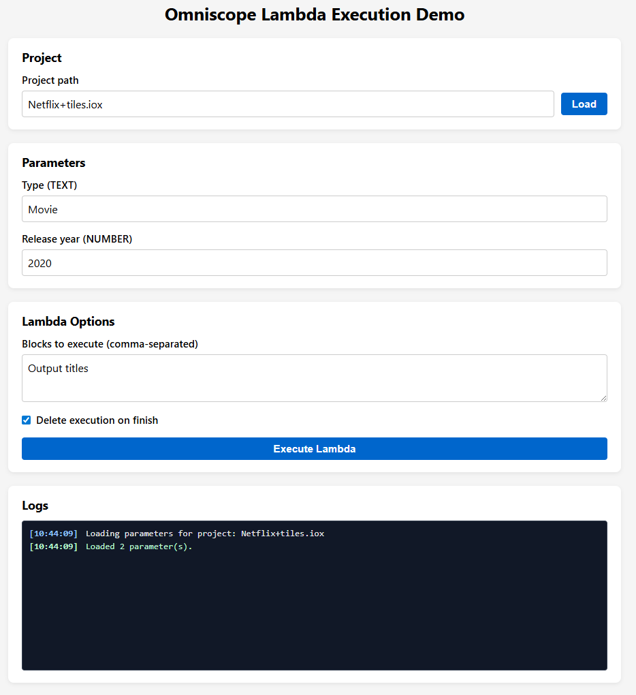

# Omniscope Lambda Workflow Runner

This example application demonstrates how to execute Omniscope workflows using the **lambda execution API** (`/lambdaexecute`).



## Overview

The Lambda Workflow Runner is a lightweight front‑end tool built with Vite and vanilla JavaScript.  
It lets you trigger an Omniscope workflow execution on‑demand, optionally update workflow parameters, and monitor the execution state in real time.

Lambda execution runs the workflow inside a **temporary project clone**.  
This means:
- The original project remains unchanged  
- Parameter updates apply only to this isolated run  
- Blocks can be selectively executed  
- The execution is safely disposed of afterward (if configured)

This makes lambda execution ideal for ad‑hoc runs, automated processing, integrations, and API‑driven workflows.

## Features

- Enter a project path and load workflow parameters dynamically  
- Modify parameters before execution  
- Specify individual blocks to run or execute the entire workflow  
- Toggle whether the temporary execution environment is deleted after completion  
- Trigger workflow execution via `/lambdaexecute`  
- Real‑time job state polling (RUNNING, COMPLETED, FAILED, etc.)  
- Colour‑coded logs with timestamps for clarity  

## How to Run

1. Install dependencies:
   ```
   npm install
   ```

2. Start the development server:
   ```
   npm run dev
   ```

3. The app will be available at:
   ```
   http://localhost:5173
   ```

Ensure Omniscope is running locally and accessible at the API port (`127.0.0.1:24679` by default).  
The included `vite.config.js` proxies requests from `/workflow-api/` to this backend.

