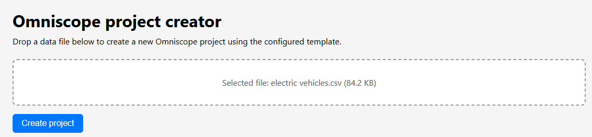

# Omniscope Project Creator – Example Application

This repository contains a minimal example showing how to create **Omniscope EVO projects** programmatically using the **Project API**, with a simple drag-and-drop web interface and a lightweight Node.js backend.

The goal of this example is to demonstrate:

- How to upload a file from a browser  
- How to place that file in an Omniscope-accessible directory  
- How to call the **Project API `/create`** endpoint  
- How to open the newly created project in Omniscope  
- How to embed files into a `.data` folder when required  

This is intentionally simple and framework-free, making it easy to adapt or extend.

---

# 📸 Screenshots

### Upload Page



---

# ✨ Features

- 🖱 Drag-and-drop file upload  
- 📁 Automatically copies the file into the Omniscope file system  
- 📦 Optionally embeds files into `<project>.data/embed/`  
- 🧱 Calls the Omniscope Project API to create new projects  
- 🌐 Frontend built with Vite + Vanilla JavaScript  
- 🖥 Backend built with Node.js, Express, and Multer  
- 🔗 Automatically opens the created project in a new browser tab  
- 🔧 Fully configurable through a simple `config.json`  

---

# 🛠 Technologies Used

### Frontend
- Vite (dev server + bundling)
- Vanilla JavaScript
- HTML/CSS
- Fetch API

### Backend
- Node.js
- Express
- Multer
- Native Fetch
- ES Modules (`import` syntax)

### Omniscope
- Omniscope EVO Server
- Project API (`/create` endpoint)

---

# 📁 Project Structure

```
omniscope-project-creator/
│
├── frontend/                   # Frontend served by Vite
│   ├── index.html
│   └── main.js
│
├── backend/                    # Node/Express backend
│   ├── server.js
│   ├── config.example.json     # Template for user configuration
│   └── config.json             # NOT committed (gitignored)
│
├── vite.config.js              # Vite root + proxy settings
├── package.json
├── package-lock.json
├── .gitignore
└── README.md
```

---

# ⚙ Configuration

Before running the example, create and customise your configuration file.

## 1. Copy the example config

```
cp backend/config.example.json backend/config.json
```

## 2. Edit `backend/config.json`:

```json
{
  "projectApiBaseUrl": "http://127.0.0.1:24679/YourProject/_api_/v1/",
  "uploadRootPath": "C:\path\to\omniscope-server\files\YourProject",
  "templateId": "Import data file",
  "fileParamName": "File source",
  "isEmbedded": true,
  "omniscopeBaseUrl": "http://127.0.0.1:24679"
}
```

### Configuration fields

| Field | Description |
|-------|-------------|
| `projectApiBaseUrl` | Base URL of the Omniscope Project API (`/_api_/v1/`) |
| `uploadRootPath` | Where uploaded files are stored for Omniscope |
| `templateId` | Template ID to use for project creation |
| `fileParamName` | Parameter name inside the template that receives the file name |
| `isEmbedded` | If `true`, moves file into `<name>.data/embed/` before creating project |
| `omniscopeBaseUrl` | Root URL of your Omniscope server, used to open the created project |

---

# 🚀 Getting Started

## Install dependencies

```
npm install
```

## Start the backend

```
npm run server
```

Backend runs on:  
**http://localhost:3000**

## Start the frontend

```
npm run dev
```

Frontend runs on:  
**http://localhost:5173**

## Use the app

Open the frontend URL in your browser and drop a file into the drop area.

---

# 🔄 How It Works

### 1. User drops a file  
The UI highlights the drop zone and stores the selected file.

### 2. Frontend sends the file to the backend  
Sent via `POST /api/create-project` as `multipart/form-data`.

### 3. Backend stores the file  
Depending on `isEmbedded`:

- If `false`: copied to `uploadRootPath`
- If `true`: moved to  
  ```
  <uploadRootPath>/<projectName>.data/embed/<filename>
  ```

### 4. Backend calls the Project API  
Example payload:

```json
{
  "name": "projectName",
  "templateId": "Import data file",
  "parameters": {
    "File source": "filename.csv",
    "isEmbedded": true
  }
}
```

Sent to:

```
POST {projectApiBaseUrl}/create
```

### 5. Omniscope creates the project  
The API returns:

```json
{
  "name": "projectName",
  "path": "/SomeFolder/projectName.iox/"
}
```

### 6. Frontend opens the project  
The URL is built using:

```
{omniscopeBaseUrl}{project.path}
```

A new browser tab opens automatically.

---

# 🧪 Testing

To test:

1. Drop a `.csv` or similar data file  
2. Click **Create project**  
3. Verify:  
   - File saved in Omniscope folder  
   - Project appears in Omniscope  
   - Browser opens the new project  
   - Backend logs the workflow  

---

# 🔒 Notes

- Authentication is not included (add headers as needed)  
- This is a demo — for production:  
  - Validate filenames  
  - Improve error handling  
  - Sanitise input  
  - HTTPS recommended  
  - Logging and monitoring  

---

# 📚 Possible Enhancements

- Template dropdown  
- Support multiple parameters  
- Display API logs in UI  
- File size validation  
- Upload history  
- Authentication integration  

---

# 🤝 Contributing

PRs and suggestions are welcome!

---

# 📄 License

MIT License

---

# 🖼 Additional Screenshots

*(Insert screenshot of project creation success message here)*  
``
