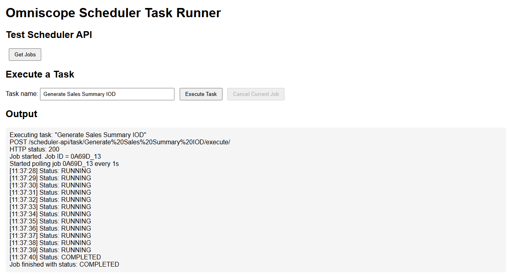

# Omniscope Scheduler Task Runner

*A simple example application demonstrating how to interact with the
Omniscope Scheduler REST API.*



------------------------------------------------------------------------

## Overview

This example shows how to execute and monitor Omniscope Scheduler tasks
from a lightweight web interface built using **Vite** and **vanilla
JavaScript**.

The app lets you:

-   Run an existing Omniscope Scheduler task.
-   Automatically poll its job status every second.
-   View live job status updates (QUEUED, RUNNING, COMPLETED, FAILED,
    CANCELLED).
-   Cancel the job while it is running.
-   Optionally test connectivity to the Scheduler API by calling `/all`
    to list recent jobs.

It is intended as a clear, minimal demonstration of how to call the
Scheduler API from a browser-based application.

------------------------------------------------------------------------

## How It Works

The application provides a clean UI consisting of:

-   **Task name input** --- enter the name of a Scheduler task
    configured in Omniscope.
-   **Execute Task** button --- triggers the task using\
    `POST /task/{taskName}/execute/`
-   **Live status polling** --- after execution, the app polls\
    `GET /job/{jobId}/` every 1 second until the job reaches a terminal
    state.
-   **Cancel Current Job** button --- sends\
    `DELETE /job/{jobId}/` to request cancellation.
-   **Get Jobs** button --- calls `/all/` to confirm connectivity to the
    API.

All logs and status messages appear in a scrolling output panel for easy
visibility.

------------------------------------------------------------------------

## Development Setup

### 1. Install dependencies

``` bash
npm install
```

### 2. Start the development server

``` bash
npm run dev
```

Open the URL shown in the terminal (usually `http://127.0.0.1:5173/`).

------------------------------------------------------------------------

## About the Vite Proxy

By default, the dev setup uses a **Vite proxy** so the browser can
access the Omniscope Scheduler API without CORS issues.

The frontend calls relative URLs such as:

    /scheduler-api/all/
    /scheduler-api/task/{taskName}/execute/
    /scheduler-api/job/{jobId}/

These are rewritten by the proxy to:

    http://127.0.0.1:24679/_admin_/scheduler/api/v1/...

You can change the target or disable the proxy in `vite.config.js` if
you prefer to call the API directly.

------------------------------------------------------------------------

## Folder Contents

    index.html        – UI structure
    script.js         – Logic for executing tasks, polling job status, and cancelling jobs
    vite.config.js    – Dev server configuration + proxy setup
    package.json      – Dependencies and npm scripts
    screenshot.png    – UI screenshot
    README.md         – This documentation

------------------------------------------------------------------------

## Summary

This example demonstrates how easy it is to integrate with the Omniscope
Scheduler REST API using a small Vite-powered web app. It is designed as
a starting point for building more advanced automation dashboards or
custom interfaces for running and monitoring Omniscope tasks.
