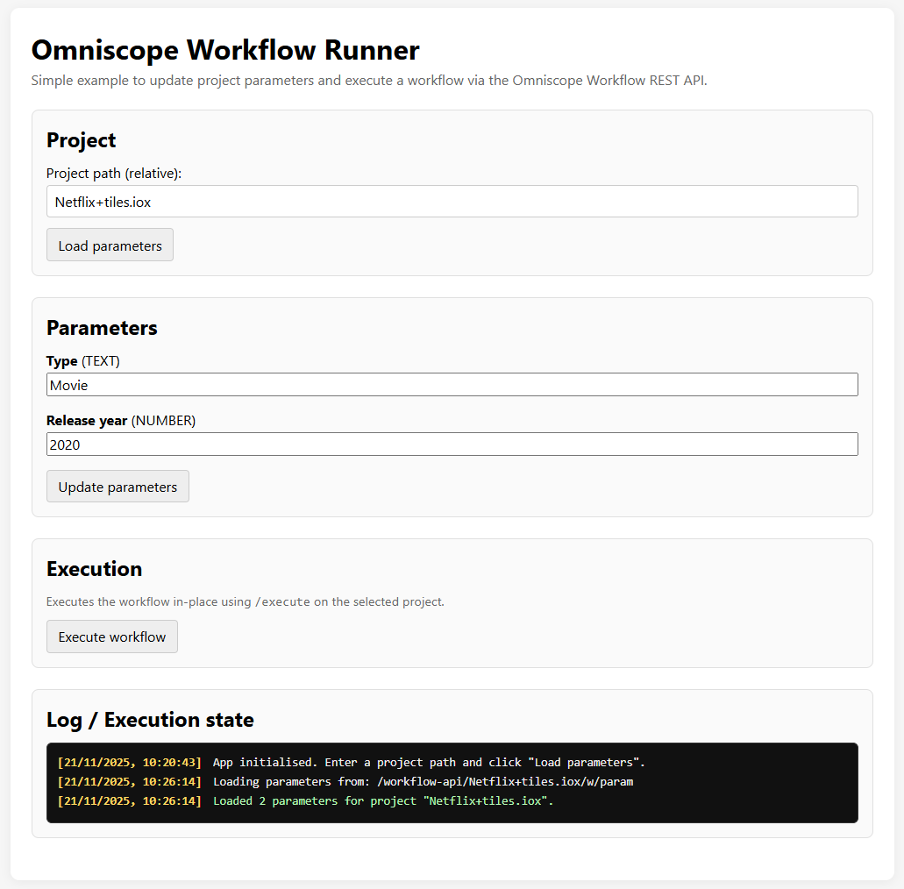

# 📘 **omniscope-workflow-runner**

A lightweight example application demonstrating how to interact with the
**Omniscope Workflow REST API** using **Vite**, **vanilla JavaScript**,
and a simple browser UI.

This example focuses on two core Workflow API capabilities:

-   **Reading and updating project parameters**
-   **Executing a workflow and monitoring its progress**

It is designed to be easy to understand, easy to extend, and ideal as a
starting point for building automations or embedding Omniscope workflow
controls into other systems.



------------------------------------------------------------------------

## 🚀 Features

### 🔹 Load project parameters

Enter a relative project path such as:

    Customer+Satisfaction/Dashboard.iox

The app retrieves the parameter list via:

    GET /param

and displays editable fields for each parameter.

### 🔹 Update parameters

Modify values in the UI and update them using:

    POST /updateparams

The request conforms to the `UpdateWorkflowParametersRequest` schema.

### 🔹 Execute workflow

Trigger a workflow run using:

    POST /execute

A minimal request is sent (all blocks executed, no refresh, don't cancel
existing jobs, wait for idle).

### 🔹 Monitor job state

After execution starts, the app polls:

    GET /job/{jobId}/state

every 2 seconds until the workflow completes, fails, or is cancelled.\
Status updates are displayed live in the log panel.

### 🔹 Clean, readable log output

The log area uses:

-   bold timestamps\
-   colour-coded entries (info / success / error)\
-   auto-scrolling as new entries arrive

------------------------------------------------------------------------

## 📦 Installation & Setup

### 1. Install dependencies

``` bash
npm install
```

### 2. Start the development server

``` bash
npm run dev
```

This launches a Vite development server (e.g. http://localhost:5173/).

### 3. Omniscope connection (Vite proxy)

To avoid CORS issues, the app uses a dev-time proxy:

    /workflow-api/ → http://127.0.0.1:24679/

That means a fetch like:

    /workflow-api/Customer+Satisfaction/Dashboard.iox/w/param

is forwarded to:

    http://127.0.0.1:24679/Customer+Satisfaction/Dashboard.iox/w/param

No special configuration is needed in the browser.

------------------------------------------------------------------------

## 🗂 Project Structure

    omniscope-workflow-runner/
    │
    ├── index.html          # UI layout
    ├── main.js             # App logic: parameter loading, updating, execution, polling
    ├── style.css           # Styles, including the log panel
    ├── vite.config.js      # Dev proxy for the Omniscope Workflow API
    ├── package.json        # Dependencies and scripts
    └── screenshot.png      # Example screenshot


