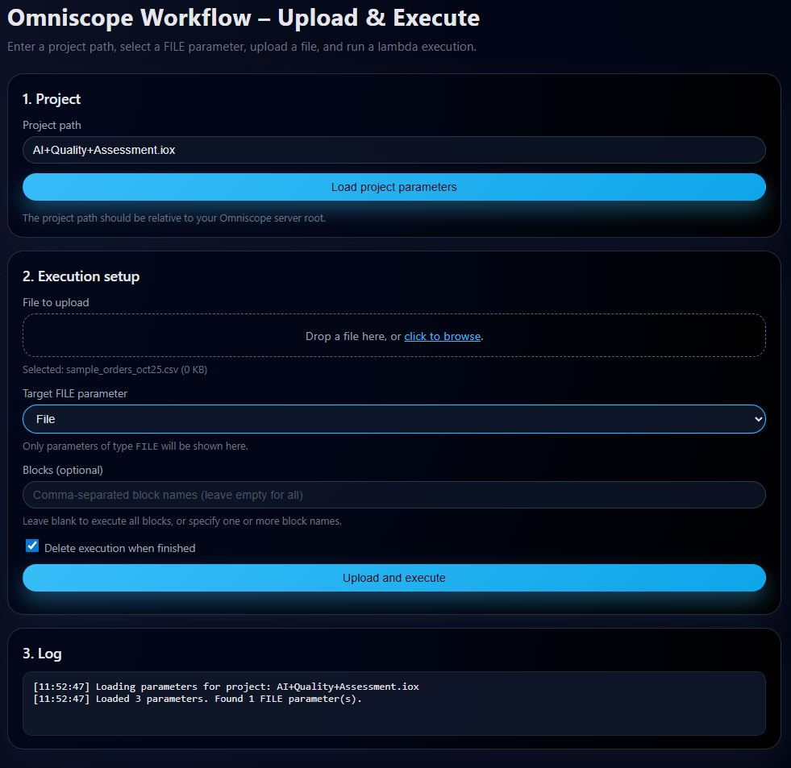

# Omniscope Workflow – Upload & Execute

A lightweight example application demonstrating how to update a workflow file parameter using the Omniscope Workflow API, upload a replacement file, and execute the workflow using the `/uploadandexecute` endpoint. This example is intentionally simple: a single HTML page, vanilla JavaScript, and a Vite dev server with a proxy for API calls.



## Features
- Enter a project path (e.g. `My+Folder/Netflix+tiles.iox`).
- Load project parameters and automatically detect `FILE` parameters.
- Drag-and-drop or browse to select a file for upload.
- Optionally specify block names to execute.
- Toggle `deleteExecutionOnFinish`.
- Trigger a lambda-style upload-and-execute call.
- Polls job status with live log updates.

## Getting Started

### 1. Install dependencies
```bash
npm install
```

### 2. Run the dev server
```bash
npm run dev
```
This starts a Vite dev environment with a proxy so that calls to `/workflow-api/...` automatically forward to your Omniscope server.

### 3. Using the App
1. Enter the relative project path into the text box.  
2. Click **Load project parameters** to fetch available workflow parameters.  
3. Choose a `FILE` parameter from the dropdown.  
4. Drop or select the file you want to upload.  
5. Optionally specify block names (comma‑separated).  
6. Click **Upload and execute**.  
7. Watch the log panel for job state updates.

## File Structure
```
omniscope-workflow-upload-and-execute/
├── index.html
├── main.js
├── style.css
├── vite.config.js
├── screenshot.png
└── README.md
```

## Notes
- Uses only vanilla JavaScript and fetch API.  
- The Vite proxy forwards `/workflow-api/...` to your Omniscope server at `http://127.0.0.1:24679`.  
