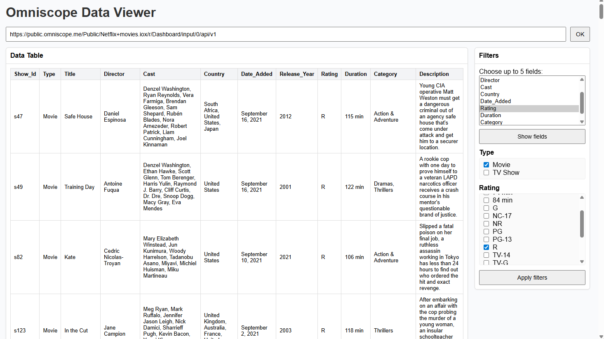

# Simple Table with Filters

Self-contained example that renders a table on the left with a right-hand filter panel. Selecting fields/filters updates the table immediately. Includes a Vite dev proxy to avoid CORS during local development.



## ✨ Features

### 🔌 Connect to any Omniscope Report API

Paste an endpoint such as:

    https://public.omniscope.me/Public/Netflix+movies.iox/r/Dashboard/input/0/api/v1

Or use path-only form:

    /Public/Netflix+movies.iox/r/Dashboard/input/0/api/v1

### 📊 Live Table View

Loads data immediately after clicking **OK**. Supports pagination.

### 🧩 Dynamic Filter Fields

Choose up to 5 fields, fetch distinct values, tick checkboxes.

### 🪄 Apply Filters

Applies `IN` filters via Omniscope's REST API.

## 🚀 Quickstart

``` bash
npm install
npm run dev
```

Open:

    http://localhost:5173

## 🛠 Development Proxy (CORS)

Vite proxy used to bypass CORS:

``` js
proxy: {
  "/proxy": {
    target: "https://public.omniscope.me",
    changeOrigin: true,
    rewrite: p => p.replace(/^\/proxy/, ""),
  }
}
```

## 🔍 How It Works (API Calls)

### 1. Schema

`GET /schema`

### 2. Distinct values

`POST /table` with UNIQUE_VALUES grouping.

### 3. Data rows

`POST /table` with fields, filters, and range.


